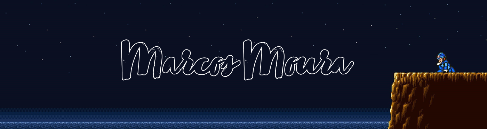

  <h1>Hello everyone, pleasure.</h1>
  
I'm a newbie in this programming world, I got into it because I'm passionate about everything about Artificial Intelligence and Machine Learning. So I decided to start with python, but I'm also learning about web development. <a href = "mailto:businessmoura@outlook.com">let me know if you have any questions</a>. Looking forward to working with you! I am 10 billion percent sure.
 

  <a href="https://github.com/marcodmoura">
  
  

  

 
  
  
  
  
  
  <!---->

  
##
  

  <!--
  -->
 	
  
  
  <!---->
 
   

  

  

  
